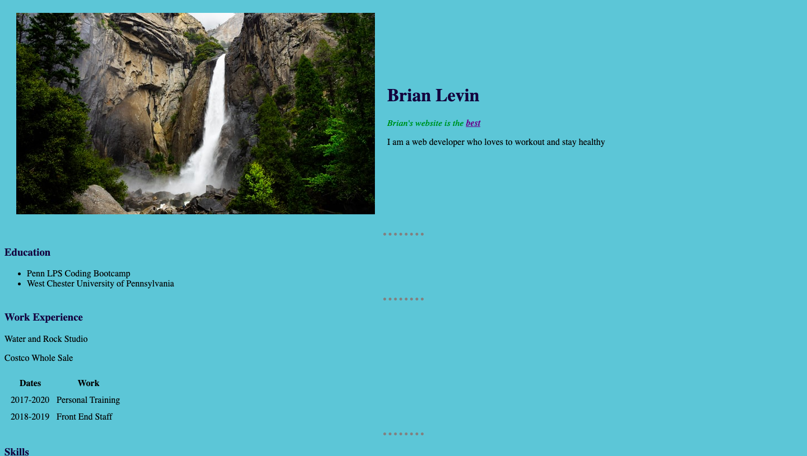
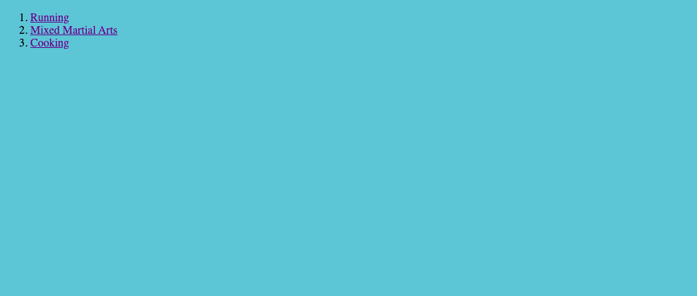
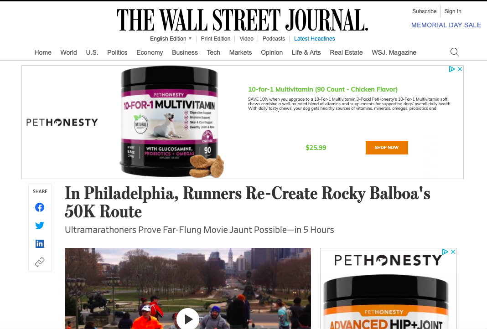
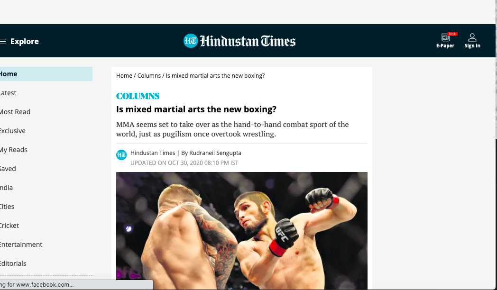
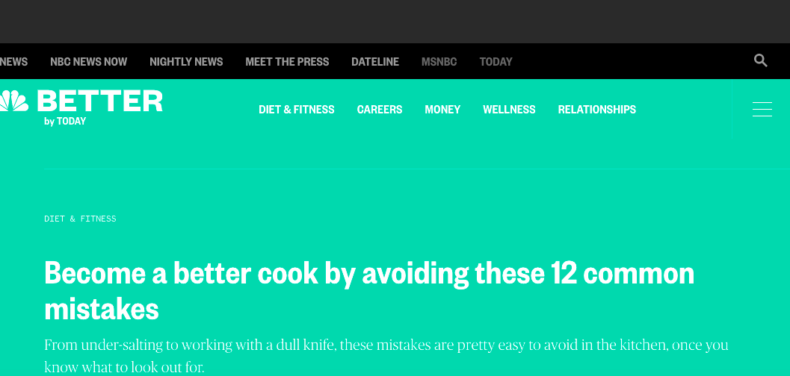
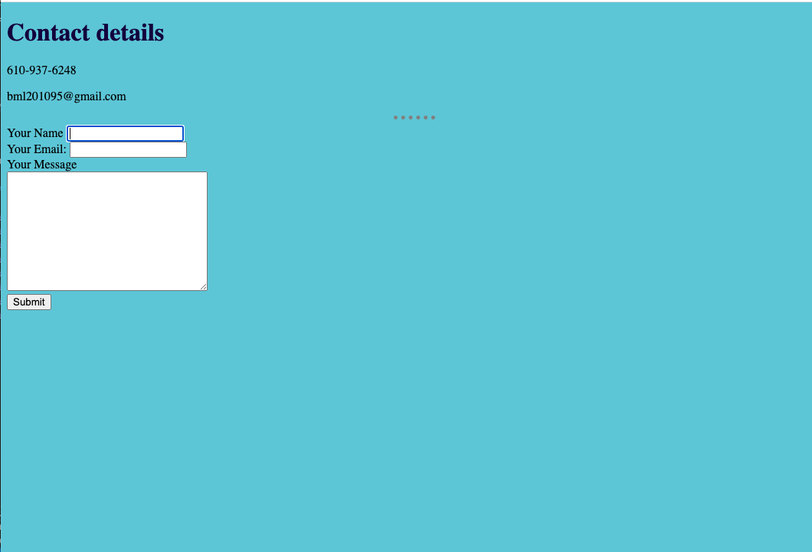
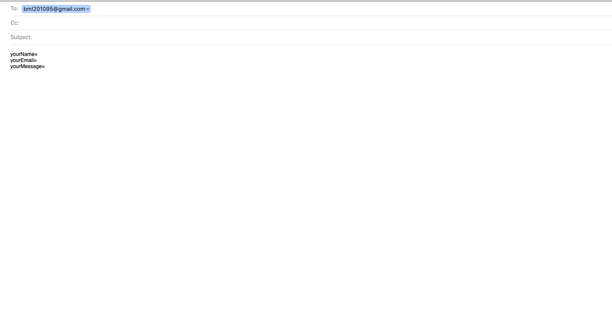

# Basic About Me Site

## Application description:

A basic  HTML website  with some CSS that introduces who I am and lets the user link to differant pages I have displayed. This includes my home page,  hobbies page, and contact page. Each link to the hobbies page brings the user to a article about the hobbie and the contact page uses a form action to allow the user to email the owner.
 

 ## Click [here]( https://brianlevin.github.io/Basic-About-Me-Website/) for the live app. 
 
 This is the home screen:
 
 
 
 
  
 
This is my hobbies page:
 

  
  These are the links that are clicked to lead to articles  that pertain to my hobbies:
  
 
  
   
     
  
  This is the contact page
  
     
  
  This is the email template   that pops up once the user clicks subit on the form:
  
  
    
  
  ## Libraries and Frameworks:

- HTML
- CSS

## Email:

bml201095@gmail.com
